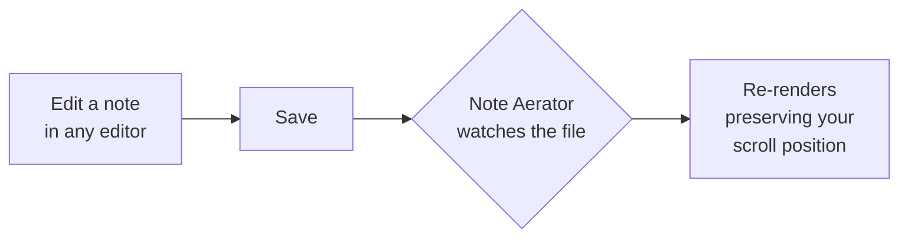

# Tips and tricks

A short tour of the features beyond "just render this Markdown file."

## Search

- **`Ctrl+F`** opens an in-page find bar (browser-style search
  inside the rendered document).
- The **🔍 icon** in the top-right corner opens a project-wide
  search that also searches across sidecar comments.
- Use **`Enter`** / **`Shift+Enter`** to step through matches.

## Archive

Right-click any file in the sidebar → **Move to Archive**. The file
moves into an `archive/` subfolder next to it (created on demand) and
disappears from the main list. Open the `Archive` drawer at the
bottom of the sidebar to find it again.

This is just a folder move — no database, no hidden state. You can
also move files into `archive/` yourself with File Explorer and Note
Aerator will pick them up.

## Inline AI directives

Anywhere in a Markdown file you can leave a hint for an AI assistant:

```markdown
<!-- @ai: please rewrite this paragraph to be punchier -->
```

The marker renders as a yellow callout in the viewer. When you next
run an AI assistant (for example, GitHub Copilot CLI) on the folder,
it can pick the directive up, act on it, and remove the comment.

`<!-- @ai-done: rewrote per request -->` renders as a green callout
and is a great way to leave a paper trail of what changed and why.

Live example, rendered:

<!-- @ai: I'm an inline AI directive. An AI assistant pointed at this folder would act on me and remove me. -->

## Sidecar comments (right-click on any block)

- **Right-click** any heading, paragraph, list item, code block, or
  table cell → **Add comment here**.
- Or **hover** over a block and click the small **+** that appears
  in the left margin.

Comments are saved to a tiny JSON file next to the Markdown
(`<basename>-comments.json`), so your `.md` source file stays clean
and merges cleanly across devices.

## Prefix grouping

If you have files with shared dash-separated prefixes — e.g.
`corp-orcl.md`, `corp-orcl-thomas.md`, `corp-anthropic.md` — Note
Aerator groups them into a collapsible tree in the sidebar so the
list stays readable as it grows.

Right-click a project tab → uncheck **Group by prefix** to turn it
off for that project. (It's per-project, on by default, saved with
the project.)

A few nice touches that fall out of the algorithm:

- A leading numeric token like `30-` is treated as a *sort key*, not
  as a grouping token, so `00-running-status.md` and
  `30-quarterly-plan.md` won't group with each other.
- `<prefix>-overview.md` acts as the anchor file for `<prefix>` —
  other `<prefix>-…` files nest under it.
- A meaningless single-child parent (`corp` containing only `orcl`)
  is collapsed and rendered as `corp-orcl` directly.

## Diagrams

Mermaid is built in. Drop a fenced code block tagged ` ```mermaid `:



## Math

LaTeX-style math via KaTeX, both inline ($e^{i\pi} + 1 = 0$) and
display:

$$
\int_{-\infty}^{\infty} e^{-x^2}\, dx = \sqrt{\pi}
$$

## Task lists

GitHub-flavored Markdown task lists work and are interactive in
upstream editors (Note Aerator renders them, doesn't edit them):

- [x] Install Note Aerator
- [x] Read the welcome doc
- [ ] Point it at my own notes folder
- [ ] Try a `<!-- @ai: ... -->` directive
