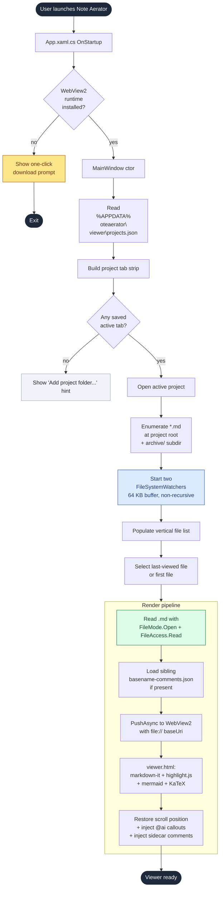
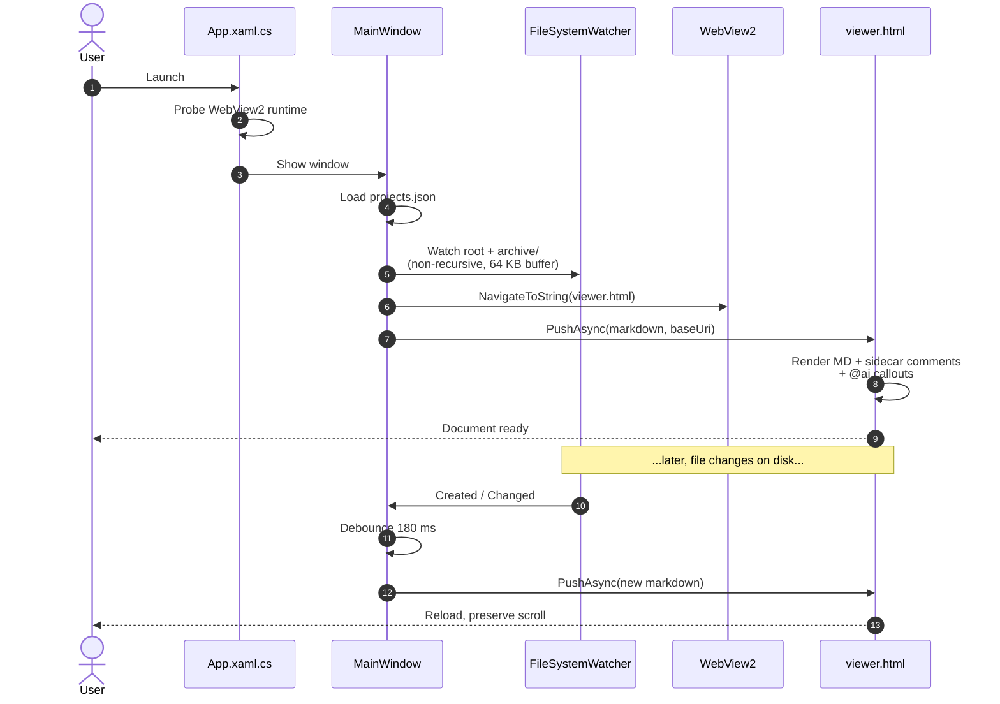

# App startup flow

How Note Aerator gets from a double-click on the Start menu tile to a
rendered Markdown document on screen.

## What each step is doing

1. **WebView2 check.** Note Aerator is a thin WPF shell around a
   WebView2 control. If the runtime is missing (rare on Windows 11,
   occasional on older Windows 10 installs), the app surfaces a single
   "Install WebView2" button instead of crashing.

2. **Project state.** The list of folders you've added — and which one
   was active last — lives in `%APPDATA%\noteaerator\viewer\projects.json`.
   That file is the only thing the app writes outside the folders you
   point it at. Your `.md` files are never modified.

3. **Two watchers, not one.** Each project gets two non-recursive
   `FileSystemWatcher`s (one on the root, one on the optional
   `archive/` subdir) with a 64 KB internal buffer. The deliberate
   non-recursion keeps the watcher reliable on top of OneDrive,
   Dropbox, and Google Drive folders, where deep sync churn can
   otherwise overflow the buffer and silently drop events for
   top-level changes.

4. **Read-only Markdown access.** Files are opened with
   `FileMode.Open` + `FileAccess.Read` — the viewer cannot accidentally
   write to a Markdown file even if you tried to make it.

5. **Render pipeline.** The Markdown text plus the base URI of the
   source file is pushed into `viewer.html`. The renderer there is a
   standard `markdown-it` + `highlight.js` + `mermaid` + `KaTeX`
   stack, with two small additions: a CSS callout for
   `<!-- @ai: ... -->` and `<!-- @ai-done: ... -->` markers, and an
   overlay for any human comments in the sidecar JSON.

6. **State restoration.** Scroll position is preserved across reloads
   so editing a long note in your favorite editor doesn't bounce you
   back to the top every time you save.

That's it — there are no background services, no telemetry round-trips,
and no network calls beyond the CDN-hosted rendering libraries pulled
into the WebView2 sandbox at first paint.
